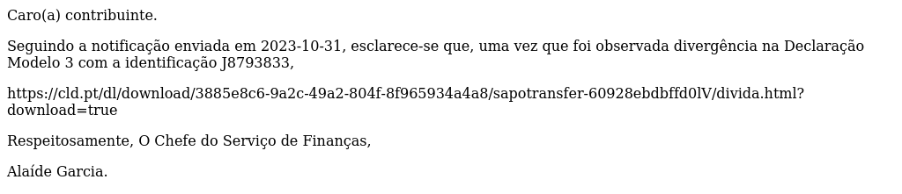

# Analysis of Bank Trojan Targeting Portuguese Banks

The threat arrived through an email from an external address, in what is a typical phishing attempt.
After some analysis, we were interested in it as it had several relevant redirections and artifacts.

## Initial files

The email is as suspicious as it can be:



The date of the message (2023-10-31) is relevant as the binary is also tagged with a string which may be related to this (`3out31`), and may be used to identify variants.

Included is a link to ```hxxps://cld[.]pt/dl/download/3885e8c6-9a2c-49a2-804f-8f965934a4a8/sapotransfer-60928ebdbffd0lV/divida[.]html?download=true```
The target is a file named ```divida.html``` being provided by Meo Cloud. Meo Cloud is a popular file hosting service from a Portuguese service provider.

The file itself has almost no content, and just redirects to yet another address.

```
<meta http-equiv="refresh" content="0; 
url=hxxp://18[.]216[.]79[.]21/at/tributario.php">
```

From the link we can expect an attack dealing with our Tax Agency [Agência Tributária e Aduaneira](https://www.portaldasfinancas.gov.pt/at/html/index.html). However, ```tributario.php``` is spelled wrongly.

Accessing the url provides a file named ```Tributos_ep.vbs```. This file is clearly a VB script which some "obfuscation". 
In reality, the file has lots of comments before and after the actual instructions. We can easily clean it with `grep` `sed` fu and get the actual script.


The script will download an `mpeg` file, which actually is a `zip` named `LockSessions.zip`. The file is written to `C:\Users\Public`, extracted, and deleted. Inside there is a file named `Stacks.exe` that is executed.
While the Script is doing this, a webpage with the actual site of the Tax Agency is open by browsing to:`hxxps://tinyurl[.]com/dashboard458872104`

Up to now we have a dropper designed for the Portuguese reality. It uses a well known Portuguese hosting provider and Amazon, and targets users through the Portuguese Tax Agency.

By the link being used to download the `zip` file, the campaign is recent:
 `hxxps://comprovativos2022e2023[.]s3[.]amazonaws[.]com/LockSessions[.]mpeg`. 

Portuguese citizens usually have to provide further info starting from April, but maybe this can last until November.

The `zip` file seems standard, having just one file:

```
Archive:  LockSessions.mpeg
Zip file size: 4720172 bytes, number of entries: 1
-rwxa--     2.0 fat 16804533 b- defN 20231031.124540 LockSessions/Stacks.exe
1 file, 16804533 bytes uncompressed, 4720028 bytes compressed:  71.9%
```

## File: Stacks.exe

This is a somewhat large file for a dropper, at 17MB. Sections are the ones expected, plus some oddities, as pointed in a quick scan. It seems that no packer was used.

Further quick look with Detect It Easy results in:

- Windows GUI Application 64 bits
- Name exported is LoginVCL.exe
- Operation system: Windows(Vista)[AMD64, 64-bit, GUI]
- Linker: Turbo linker(8.00)
- Compiler: Embarcadero Object Pascal(Delphi)(35.0 (28.0.44500.8973))
- Language: Object Pascal(Delphi)
- Library: Visual Component Library
- Tool: Embarcadero Delphi(11.0 Alexandria)


From the signatures we see, this looks like a variant of `TrojanBanker:Win32/Banbra` or `Trojan:Win32/ScarletFlash.A`. The strings present are different from the original, but the similarities are relevant. It also uses Portuguese strings and commands.

The file is standard GUI application with a form. Three timers are included in the application, and the malicious code actually is called from the Timers:

- Timer 1: Download further stages
- Timer 2: Executes the stages
- Timer 3: Hides the form

Analyzing the first time, we notice it hides the strings in Resources. With this method, strings are not directly reached by the code, and are loaded using `System::LoadResString`.


The first string is loaded from `cs:8073A8`, which has the value `0x6EA3B0`. As this value is higher than 0xFFFF, it is a pointer to the actual place where the String Identifier is located.
At `cs:6EA3B0` we should have a `TResStringRec` structure. The first part is the application itself (`Sysinit::HInstance`), and in the second is the String Identifier.

```
TResStringRec = record
    Module: ^Longint;
    Identifier: Integer;
end ;
``` 

If we check the strings in the resources we get:


While the resource table looks like:


As the resources table is named `Rsrc_StringTable_fe8_0`, we can match the strings resources to the lookup table by doing: `resource_id = 0x0FE8 * 16 + base_index`. As an example, for the first string with `table_id=0x0FE74` which corresponds to `resource_id=65140` at `base_index=-12` (position from the bottom of the table) we have `0x0FE74 = 0x0FE8 * 16 - 12`. 

The rest of the timer will check if a folder `C:\AutCAD` exists and download a file. It runs twice, downloading two files named `Autodesk.exe` and `Illustrator.exe`. Although there are two paths, the code is similar, and only related with error handling. Specifically, if the folder is not created, the file is downloaded into `C:\users\public`. If it exists, the file is not downloaded again.


The files seem to come from the same S3 bucket: `hxxps://comprovativos2022e2023[.]s3[.]amazonaws[.]com`. Currently, there is no reference in VT or other platform to this bucket, but this may change rapidly.

After the download is completed, the files are executed in another Timer, using the variables `nma` and `nma2` to pass the filename to the functions.


The file `arcor.mpeg` is saved to `Illustrator.exe` while the file `bright.mpeg` is saved to `Autodesk.exe`.  Files are identified as `Trojan:Win32/ScarletFlash.A` or `TrojanBanker:Win32/Banbra`


## File: Illustrator.exe

This file is similar to the downloader, as it was created in Delphi. A quick analysis reveals several other forms besides the main one, with other Timers. We will describe each function in those timers. It follows the same pattern as the previous file, and it was created with the same toolkit.

From Detect It Easy:

- Operation system: Windows(Vista)[AMD64, 64-bit, GUI]
- Linker: Turbo linker(8.00)
- Compiler: Embarcadero Object Pascal(Delphi)(35.0 (28.0.44500.8973))
- Language: Object Pascal(Delphi)
- Library: Visual Component Library
- Tool: Embarcadero Delphi(11.0 Alexandria)

The entire operation of this malware is through Timers in Forms, which later start and stop threads. Operations supported are the ones expected in a Banker Trojan: spy on users, receive commands, upload data and persist. The program is low on resources and tries be dissimulated through its name and icon (A sound speaker... which doesn't match Illustrator).


### Persistence

One of the Timers will write a key to the registry so that the malware will start automatically. The way it is implemented is simplistic, as it assumes the malware to be at 2 specific locations. It then writes a String key named `Avetor`, to `SOFTWARE\MICROSOFT\WINDOWS\CURRENTVERSION\RUN` with the path of the file `Illustrator.exe`, if it is at one of the given locations (`C:\AutCad` or `C:\users\public`).


With this key, the malware will persist across reboots, being started at startup. The way it is implemented only seems to work if the malware is at those specific locations. It is unknown to us the meaning o `Avetor`.


### Bank Info Stealer

Another Thread will periodically poll the available windows, looking for patterns in its title. By the strings contained, it included 38 banks, all from Portugal, which is probably most commercial banks. It uses `Winapi::Windows::GetWindowTextLength` to get the number of characters, then `Winapi::Windows::GetWindowText`, cleans the string (only keeps `0123456789abcdefghijklmnopqrstuvwxyz-`), and compares the result with all the precompiled strings. Interestingly, these strings are hardcoded in the code, and are not resources as the rest.


This is used to launch an attack in an attempt to get the user input, such as credentials. Data captured is combined with the Computer Name, encrypted, and then sent to a C2 server as an `HTTP PUT` method. In the case of this sample, the destination URL used is `hxxp://89[.]223[.]127[.]198/jbl/index.php`.


As referred, the data is encrypted before being upload (hey, user safety first!). The encryption method is a very simple `XOR` of the data with a static key `YUQL23KL23DF90WI5E1JAS467NMCXXL6JAOAUWWMCL0AOMM4A4VZYW9KHJUI2347EJHJKDF3424S KL K3LAKDJSL9RTIKJ`. Interestingly, the malware has two similar encryption methods, which are able to both encrypt and decrypt data based on a argument. The code different, and also, one requires `C` (cifrar?) to select the encryption mode, while the other requires `E` (encrypt?). `D` (decifrar/decrypt?) is used in both cases to select a decryption. This points to copy and past of code, and a overall rough construction.

### Screen capture

The malware has the capability to capture images of the desktop. It is not continuously recording, but will periodically check for a condition, and then capture images with low or high quality (selectable). The capture is triggered by two global variables that, when set, trigger the screenshot with two different methods.


The resulting image is uploaded to a `PHP` script, using an `HTTP PUT` method. The server is the same, as well as the `index.php` resource. However this time the malware didn't encrypt the data.


Taking in consideration the integer provided by the C2 server, upload is made to a script with its name. The following image depicts the process of uploading user data and then an image.


### Remote Configuration

Another Timer, and operation of this variant is the capability to download a configuration from a remote server. The server is distinct from the previous one and is hosted in a public provider: `https://s3[.]timeweb[.com/41907bc4-chronocromdocrom/one/cnf[.]txt`


At the time of writing, the result was the following string:

`MrP1Kab1LaL9KqzBNGqAQ7HqS3elBpGrBZWkEJOkCJCmBs5gSoyD2cXqT70wBoyqDIuuBZasBZ4pC2zXQdCl3GfeT7HmEYylD3KkE2uvDYunCp0lOMfpBmqAQ7HqS3elBpGrBZWkEJOkCJCmBs5gSoyD2cXqT70wBoyqDIuuBZasBZ4pC2zXQdCl3GfeT7HmEYylD3KkE2uvDYunCp0lOMfpBmqAQ7HqS3elBpGrBZWkEJOkCJCmBs5gSoyD2cXqT70wBoyqDIuuBZasBZ4pC2zXQdCl3GfeT7HmEYylD3KkE2uvDYunCp0lOMfpBmqAQ7HqS3elBpGrBZWkEJOkCJCmBs5gSoyD2cXqT70wBoyqDIuuBZasBZ4pC2zXQdCl3GfeT7HmEYylD3KkE2uvDYunCp0lOMfpBmqAMq5KLK5CILf1JqPT3GenE30t3GfiR0qACWqAS79mS0`

It is encoded using Base64 as defined in [RFC 4880](https://datatracker.ietf.org/doc/html/rfc4880), which uses an alternative alphabet: `0-9A-Za-z+/=`.
After decoding with this alphabet, the result is the following block:


In order to check if the file is legit, the code has two static strings `3DC041CC50AAD31D5799B452D37E` and `XVNO38759`. The first is an encrypted string, while the second is the key. Decryption will convert every two bytes of the text to integer (from hex), `XOR` it with the key and subtract the value from the previous value. The result is `[VARIAVEISOK]`, which is compared with the first line of the configuration. If it matches, the configuration file is considered to be correct.


Accessing the server provided we get a standard Ubuntu Apache2 webpage. Accessing the URL, specifying or not `index.php`, the page is found an returns an integer. The behavior seems to be similar if we use the previously identified IP or this one. The integer returned, represents the location of a `PHP` script, providing further functionality.


### Command and Control


Commands are:

| Command | Meaning |
| -- | -- |
| `qualimg` | Sets image quality |
| `imgra` | Downloads and executes file (EXE or DLL) |
| `rstall` | Restart Computer |
| `lstgeral` | Enables Timer |
| `mtarq` | Kill Process  |


## IOCs

| __Files__ |  |  |
| -- | -- | -- |
| Hash | Artifact | External Analysis |
| 3e399f9d6135376e2184e110660594ecffe1c0a8 | `Tributos_ep.vbs` |  |
| 497aa3e1f74f72c0e6328335f675e05c8a3252b4 | `LockSessions.mpeg` |  |
| 4b54da05c4e2ef0a4fc5892cf1dfc8d63fc1d898 | `Stacks.exe` | [Joes Sandbox][joes_stacks.exe], [VirusTotal][vt_stacks.exe] |
| bff682745e529580d1c3627b23f706f2f3c0d4b1 | `Illustrator.exe` | [Joes Sandbox][joes_illustrator.exe], [VirusTotal][vt_illustrator.exe]  |


| __Registry Keys__ |
| -- | 
|` SOFTWARE\MICROSOFT\WINDOWS\CURRENTVERSION\RUN\Avetor`|

| __URLs__ |
| -- | 
| `hxxps://comprovativos2022e2023[.]s3[.]amazonaws[.]com` |
| `hxxps://s3[.]timeweb[.]com/41907bc4-chronocromdocrom/one/cnf[.]txt`

| __IP Addressses__ | 
| -- | 
|  45[.]8[.]96[.]130| 
|  89[.]223[.]127[.]198
|  18[.]216[.]79[.]21


## Remarks

Comments are corrections are welcome at gcs@ua[.]pt


[joes_stacks.exe]: https://www.joesandbox.com/analysis/1336028
[vt_stacks.exe]: https://www.virustotal.com/gui/file/338c7ce6cfaf374389e6739c4e4f3bd0dfde4c6335e7edf625a827fbc2a572dc
[vt_illustrator.exe]: https://www.virustotal.com/gui/file/05d1a67adf35f652c52c6a6235cc44dfdd2e13f0d0ca6cdd62dbe7eac63588b6
[joes_illustrator.exe]: https://www.joesandbox.com/analysis/1337308